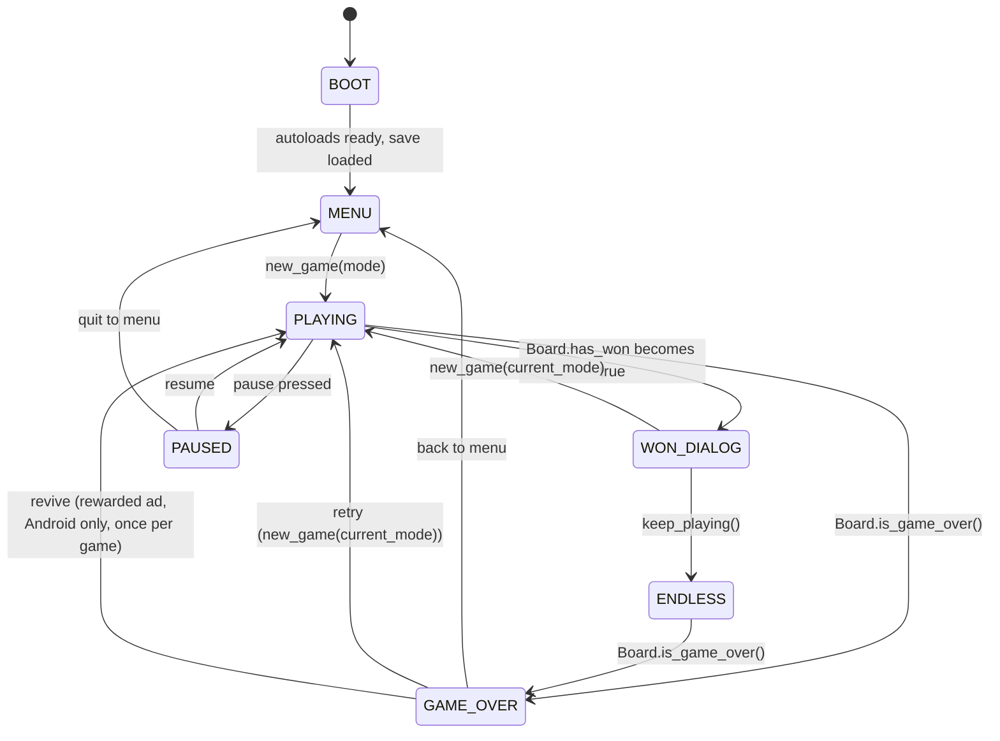

# 2048 — Game Design Document

## Pillars

1. **Respect the original.** Faithful 4×4 rules, indistinguishable feel from the 2014 classic
   when played in classic mode. All additions are opt-in via mode selection or overlay choice.
2. **Feel before features.** Slide, merge, spawn, combo — every action has a visible *and* an
   audible *and* (on Android) a haptic response.
3. **Accessibility by default.** Three themes including a Deuteranopia-safe palette; full
   keyboard navigation; text-contrast verified at WCAG AA on every tile value.
4. **Zero friction to ship.** Single codebase, single engine version, fully automated CI/CD,
   zero recurring cost. No manual build steps to release.
5. **Learn by infrastructure.** AdMob test-mode integration, proper UMP consent, release
   signing — production-grade plumbing, even if the game itself is small.

## Core loop

```
spawn 2 initial tiles → await input → attempt_move(dir) →
    if moved → slide+merge anims → spawn 1 new tile → update score/best
        → check has_won → (WON_DIALOG: keep playing | new game)
        → check is_game_over → GAME_OVER overlay
    else → no-op, re-prompt
```

## Rules

- Board is `N×N` cells, `N ∈ {3, 4, 5}`. Empty cells hold `0`; occupied cells hold powers of 2.
- At game start, two tiles spawn. Each spawn: 90% chance of `2`, 10% chance of `4`.
- Input directions: `UP`, `DOWN`, `LEFT`, `RIGHT`.
- Per direction, each row (or column) is processed independently:
  1. Strip zeros.
  2. Scan from the "near" end; adjacent equal tiles merge into one of double value. A tile
     that has already merged in this move is not eligible to merge again.
  3. Repack against the "near" end; pad the remainder with zeros.
- After a successful move (any tile changed position OR value), one new tile spawns in a
  uniformly-random empty cell with the same 90/10 value probability.
- **Win** — the first time a `2048` tile exists after a merge, `has_won` flips to `true` and
  the Won dialog appears (exactly once per game). Choosing "Keep playing" enters `ENDLESS`.
- **Game over** — when no empty cell exists AND no two orthogonally-adjacent tiles share a
  value, the game ends.

## Scoring

Per merge of two `V` tiles into a `2V` tile, **base points = `2V`**. A move's `score_delta`
sums all base points, then multiplies by the **combo factor**:

| Merges in one move | Combo factor |
|---|---|
| 1 | 1.00 |
| 2 | 1.25 |
| 3 | 1.50 |
| 4+ | 2.00 |

The combo factor never decreases the score (no penalty for single-merge moves). The
rendered "×N COMBO" toast appears only when the factor is > 1.0.

## Modes

| Mode | Size | Seed | Best-score slot | Notes |
|---|---|---|---|---|
| Classic | 4×4 | `OS.get_unique_id() XOR Time.get_ticks_usec()` | `best/classic` | Default. |
| Daily | 4×4 | `int(yyyymmdd)` in UTC | `best/daily_YYYYMMDD` | One scored attempt per day; replays playable but unscored. |
| 3×3 | 3×3 | classic-style | `best/size_3` | Faster games, smaller board. |
| 5×5 | 5×5 | classic-style | `best/size_5` | Longer games, more combos. |

## Scene graph

```
Main (Control)
├── Background (ColorRect)
├── BoardView (Control)
│   └── TileView[] (Control children, manually positioned)
├── HUD (Control)
│   ├── ScoreLabel
│   ├── BestScoreLabel
│   ├── ModeBadge
│   ├── UndoButton
│   ├── RestartButton
│   └── SettingsButton
├── ComboToastLayer (CanvasLayer)
└── OverlayLayer (CanvasLayer)
    ├── MenuOverlay
    ├── PauseOverlay
    ├── WonOverlay
    ├── GameOverOverlay
    ├── SettingsPanel
    ├── StatsPanel
    ├── AchievementsPanel
    ├── TutorialOverlay
    └── AchievementToast
```

## App FSM



## Tuning values

Placeholders; refined during M3 against the real web build.

| Param | Value | Notes |
|---|---|---|
| `SLIDE_TWEEN_MS` | 120 | Per-tile move animation |
| `MERGE_POP_MS` | 120 | Scale 1.0 → 1.15 → 1.0 |
| `SPAWN_FADE_MS` | 80 | Opacity + scale 0 → 1 |
| `INPUT_BLOCK_MS` | 160 | Buffer after animation start before accepting next input |
| `SWIPE_THRESHOLD_PX` | 40 | Minimum drag distance to register swipe |
| `SWIPE_DOMINANT_RATIO` | 1.5 | Dominant axis must exceed the other by this factor |
| `UNDO_STACK_SIZE` | 16 | In-memory cap |
| `REVIVE_SNAPSHOT_COUNT` | 3 | Pre-game-over snapshot ring for rewarded revive |
| `HAPTICS_TAP_MS` | 20 | `Input.vibrate_handheld(20)` |
| `HAPTICS_MERGE_MS` | 35 | |
| `HAPTICS_WIN_MS` | 120 | |
| `INTERSTITIAL_EVERY_N_GAMES` | 3 | Frequency cap |
| `INTERSTITIAL_MIN_INTERVAL_S` | 60 | Time-based cap (hard floor) |

## Palettes

### Dark
Background `#111114`, grid background `#1c1c22`, empty cell `#2a2a33`.
Tile values (bg / fg):
`2`: `#3b3b47 / #eeeeee` · `4`: `#454e5a / #eeeeee` · `8`: `#f2b179 / #222` · `16`: `#f59563 / #fff` ·
`32`: `#f67c5f / #fff` · `64`: `#f65e3b / #fff` · `128`: `#edcf72 / #fff` · `256`: `#edcc61 / #fff` ·
`512`: `#edc850 / #fff` · `1024`: `#edc53f / #fff` · `2048`: `#edc22e / #fff` · `>=4096`: `#3c3a32 / #fff`.

### Light
Mirror of the classic Gabriele Cirulli palette — `#faf8ef` background, grid `#bbada0`, tiles
as in the original. Text `#776e65` on light tiles, `#f9f6f2` on dark tiles.

### Colorblind (Deuteranopia-safe)
Blue / yellow axis, high luminance separation between adjacent values; validated against
[Coblis](https://www.color-blindness.com/coblis-color-blindness-simulator/) at Deuteranopia 100%.

Exact values finalized in M5 with a contrast audit.

## Audio

- `sfx/move.ogg` — short click, plays on any moving tile
- `sfx/merge.ogg` — softer thump, plays once per move (not per merge)
- `sfx/combo.ogg` — rising tone, plays when combo factor > 1.0
- `sfx/win.ogg` — short triumphant chime
- `sfx/game_over.ogg` — descending tone
- `sfx/achievement.ogg` — glass-chime
- `sfx/ui_click.ogg` — button taps

All sourced from CC0 or OFL packs, committed under `assets/sfx/`.

## Persistence schema (v1)

```
[best]
classic = 0
size_3 = 0
size_5 = 0

[daily]
YYYYMMDD_score = 0
YYYYMMDD_attempts = 0

[prefs]
theme = "dark"              # dark | light | colorblind
mode = "classic"            # classic | daily | size_3 | size_5
lang = "en"                 # en | pt_BR
sound_volume = 0.8
music_volume = 0.6
haptics_enabled = true
tutorial_seen = false

[in_progress]
mode = ""
board_cells = []
board_size = 4
score = 0
has_won = false
elapsed_seconds = 0

[stats]
games_played = 0
total_merges = 0
total_score = 0
highest_tile = 0
wins_2048 = 0
total_play_seconds = 0
best_time_to_2048_seconds = 0

[achievements]
# id = unlock_epoch_seconds
first_merge = 0
# ... (one key per unlocked achievement; absence = locked)
```

Schema version is stored as `meta.version = 1` at the top of the file. Migrations in future
majors are handled by `SaveManager.migrate(from, to)` at load time.

## Non-goals (v1)

- Cloud saves, accounts, or sync
- Online leaderboards of any kind
- Monetized (real-money) ads
- Play Store publication
- Desktop native builds
- Cosmetic unlocks / store
- Tutorial branching or skippable steps beyond "skip all"
