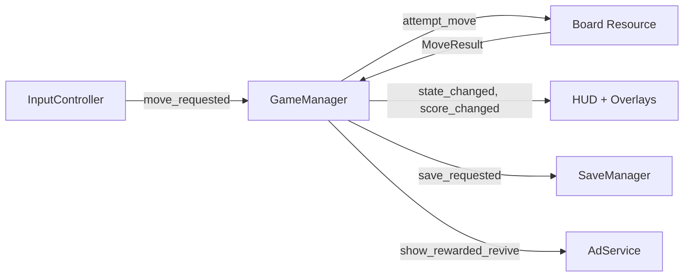

<div align="center">

# 2048

**A modern take on the sliding-tile puzzle — in Godot 4, targeting web and Android.**

Classic 4×4 rules plus 3×3 / 5×5 variants, daily challenges seeded by date, combo-multiplier
scoring, undo, forest-green / light / colorblind-safe themes, lifetime stats, local
achievements, and a rewarded-ad "revive" on Android. Single codebase, two targets, zero
running cost.

[](https://godotengine.org/)
[](https://docs.godotengine.org/en/stable/tutorials/scripting/gdscript/)
[](./LICENSE)
[](https://github.com/0xRnato/2048/actions/workflows/ci.yml)
[](https://github.com/0xRnato/2048/actions/workflows/export-web.yml)

[Architecture](#architecture) · [Quickstart](#quickstart) · [Stack](#stack) · [Features](#features) · [Contributing](#contributing)

</div>

---

## Why

2048 is deceptively small. The rules fit in a paragraph, but a production-grade build of it
still has to cover every subsystem a real game touches: pure-data core, rendering pipeline,
input on keyboard and touch, persistence that survives a crash, animations, audio, settings,
accessibility, localization, multi-platform export, CI/CD, and in-app advertising on Android.

This project takes that full chassis seriously:

- **Logic / render split** — the board is a pure `Resource`. Moves emit `MoveResult` events;
  the renderer consumes them. Unit tests don't need a scene tree.
- **Strictly-typed GDScript** — every variable, signal, and return type is annotated.
- **Enum-based FSM** — `BOOT → MENU → PLAYING → WON_DIALOG → ENDLESS → GAME_OVER → PAUSED`,
  transitions gated through a single call, emitting a signal for the UI to react to.
- **Combo multiplier** — one move producing two merges scores ×1.25, three ×1.5, four ×2.0.
- **Daily challenge** — every player on the same UTC day plays the same seeded board.
- **Local achievements + stats** — 15-entry catalog, lifetime aggregates, toast notifications.
- **Rewarded-ad revive** — on Android only, one-per-game, undoes the last three moves.
  Learning-grade AdMob integration in test mode; web build stays ad-free.
- **Zero-cost hosting** — GitHub Pages for web, GitHub Releases for Android artifacts.

## Demo

**Web:** *coming in M6* — https://0xrnato.github.io/2048/

**Android:** *coming in M7* — APK + AAB attached to each GitHub release.

## Features

**Gameplay**
- Classic 4×4 with win at 2048 and optional endless continue
- 3×3 and 5×5 variants with separate best-score slots
- Daily challenge mode — seed derived from the current UTC date
- Combo multiplier (×1.0 / ×1.25 / ×1.5 / ×2.0 for 1 / 2 / 3 / 4+ simultaneous merges)
- Undo up to the last 16 moves
- Keyboard (arrows, WASD) + touch (swipe) input

**Polish**
- Slide + merge + spawn tweens, input blocked during animation
- "×N COMBO" floating toast on multi-merges
- SFX wired to every gameplay event
- Haptic feedback on Android (merge / win)

**Persistence & meta**
- `ConfigFile` save at `user://save.cfg`, atomic writes
- Best score per mode, in-progress game resumed on launch
- Lifetime stats panel (games, merges, highest tile, 2048s, play time, best time-to-2048)
- 15-entry local achievement catalog with toast notifications
- Settings panel: theme, mode, volumes, haptics, language, replay tutorial, reset save

**Accessibility**
- Forest (monochrome green default), light, and Deuteranopia-safe colorblind palettes (WCAG AA text contrast)
- Full keyboard navigation with visible focus ring
- First-run tutorial, re-triggerable from settings

**Platform**
- Web build — single-threaded WASM, works on GitHub Pages without COOP/COEP headers
- Android build — APK + AAB, test-mode AdMob (banner / interstitial / rewarded-revive)

## Architecture

Single scene (`main.tscn`) hosts every state. UI overlays toggle via a central
`GameManager` autoload FSM — no scene swaps during play. Board state and move resolution
live in a pure `Board` resource, decoupled from rendering.



Nine autoloads: `EventBus`, `GameManager`, `SaveManager`, `AudioManager`, `AdService`,
`StatsTracker`, `AchievementsManager`, `Haptics`, `Locale`. Everything else is scene-local
and communicates via signals — no node-path coupling, no global lookups.

Deeper walkthrough in [`DESIGN.md`](./DESIGN.md) and [`docs/architecture.md`](./docs/architecture.md).

## Stack

| Layer       | Choice                                                    |
|-------------|-----------------------------------------------------------|
| Engine      | Godot 4.6 (standard build, not .NET)                      |
| Language    | GDScript (strictly typed)                                 |
| Testing     | [GUT](https://github.com/bitwes/Gut)                      |
| Lint + fmt  | [gdtoolkit](https://github.com/Scony/godot-gdscript-toolkit) (`gdformat` + `gdlint`) |
| Pre-commit  | [pre-commit](https://pre-commit.com/) with gdtoolkit hooks |
| CI          | GitHub Actions — lint, test, import, web + android export |
| Web hosting | GitHub Pages via `actions/deploy-pages@v4`                |
| Ads         | [poing-studios/godot-admob-plugin](https://github.com/poing-studios/godot-admob-plugin) (test mode) |
| i18n        | Godot `.po` files (`en`, `pt_BR`)                         |
| Versioning  | SemVer via annotated git tags                             |

## Quickstart

Requires [Godot 4.6](https://godotengine.org/download) (standard, not .NET) and Git.

```bash
git clone git@github.com:0xRnato/2048.git
cd 2048
godot --path . --editor   # or open project.godot from the editor
```

Press `F5` to run. Keyboard: arrows or `WASD` to move, `Ctrl+Z` to undo, `Escape` to pause.

### Running tests

```bash
godot --headless --path . -s addons/gut/gut_cmdln.gd -gtest=tests/unit -gexit
```

### Manual web export

```bash
godot --headless --path . --export-release "Web" build/web/index.html
python -m http.server 8000 -d build/web
# open http://localhost:8000
```

## Project structure

```
2048/
├── .github/workflows/       # CI + export + release
├── addons/                  # GUT, AdMob plugin
├── assets/                  # fonts, sfx, icons
├── docs/                    # architecture, ads-integration, release-process
├── resources/               # themes, achievement catalog, game config
├── scenes/                  # main scene, board view, UI panels
├── scripts/                 # autoloads, game logic, input, UI, services
├── tests/                   # unit + integration (GUT)
├── translations/            # en.po, pt_BR.po
├── DESIGN.md                # game design document
├── LICENSE                  # MIT
├── README.md
├── icon.svg
└── project.godot
```

## Roadmap

| Milestone | Focus                                                                   |
|-----------|-------------------------------------------------------------------------|
| M0        | Bootstrap — scaffold, docs, CI skeleton, license                        |
| M1        | Core engine — `Board`, `MoveResult`, combo multiplier, unit tests       |
| M2        | Rendering + keyboard input — `BoardView`, `TileView`, HUD               |
| M3        | Animations + polish — slide, merge, spawn, SFX, combo toast, haptics    |
| M4        | Touch + persistence + settings — swipe, `SaveManager`, settings panel   |
| M5        | Modes + themes + stats + achievements — 4 modes, 3 themes, 15 ach.      |
| M6        | Web export + GitHub Pages deploy                                        |
| M7        | Android export — APK / AAB, CI build pipeline                           |
| M8        | AdMob integration (test mode) — banner, interstitial, rewarded revive   |
| M9        | Tutorial + v1.0 release — first-run overlay, changelog, demo assets     |

## Contributing

- **Language.** English in all code, commits, comments, file names, and public docs.
  Portuguese (BR) only in UI strings via i18n.
- **Commits.** [Conventional Commits](https://www.conventionalcommits.org/)
  (`feat(scope):`, `fix(scope):`, `docs:`, `chore:`, `ci:`). Subject-only, lowercase, < 72 chars.
- **Branching.** Trunk-based — push to `main`, short-lived feature branches for larger work.
- **Code style.** GDScript built-in conventions (`snake_case.gd`, `PascalCase` class names,
  `SCREAMING_SNAKE_CASE` constants, `_` prefix for private members). Strict typing on every
  variable and signature. `@export` tunables, not hard-coded values.
- **Before committing.** Install pre-commit: `pip install pre-commit && pre-commit install`.

See [`CONTRIBUTING.md`](./CONTRIBUTING.md) for the full workflow.

## Credits

Inspired by [**2048**](https://github.com/gabrielecirulli/2048) by Gabriele Cirulli
(MIT-licensed, 2014), which in turn was inspired by *1024* (Veewo Studio) and *Threes*
(Sirvo LLC). This is an independent Godot re-implementation written from scratch — no
code or art assets from the original are used. The original color palette is referenced
in the "Light" theme as a visual homage; the Dark and Colorblind themes are original.

## License

[MIT](./LICENSE) — © 2026 Renato Neto.
